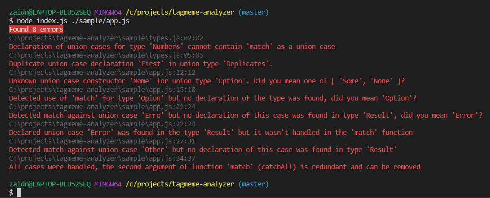

# tagmeme-analyzer 

[](https://travis-ci.org/Zaid-Ajaj/tagmeme-analyzer)   [](https://coveralls.io/github/Zaid-Ajaj/tagmeme-analyzer?branch=master) [](https://www.npmjs.com/package/tagmeme-analyzer)

Static code analyzer and CLI tool for javascript to verify correctness of pattern matching when using [tagmeme](https://github.com/andrejewski/tagmeme) by [andrejewski](https://github.com/andrejewski)

## The problem
When using `tagmeme`, you have to define the union cases as strings, here is an example:
```js
import { union } from "tagememe" 

const Option = union([ "Some", "None" ])
```
We are declaring the `Option` type that can either be `Some` or `None`. These two cases are considered constructors when creating a value of the `Option` type:
```js
const color = Option.Some("green");
```
Now that we have a value, we can pattern-match against it:
```js
const colorValue = Option.match(color, {
    Some: value => value, 
    None: () => "blue"
})
```
I really like the API but because this is javascript, it can be very error prone when working with a large application, there are many things can go wrong in runtime causing the `match` to throw an exception:
 - When forgetting to handle a case (or misspelling the case name)
 - When handling a case that wasn't declared (handling too many cases)
 - When there is a redundant `catchAll` argument that will never match (see [docs](https://github.com/andrejewski/tagmeme#documentation))
 - Using `match` as a union case
 - Using duplicate union cases in the declaration
 - Misspelling the union case when constructing a value

## Solution: Static code analysis
Because there are known variables where things could go wrong at "compile" time, why not write a program that checks the correctness of pattern matching? This is what this project provides implemented as a cli tool for easy integration with existing projects:
```
npm install --save-dev tagmeme-analyzer
```
Let's see it in action: here is a sample code with the errors that get generated:
### {repo}/sample/types.js
```js
import { union as makeUnion } from 'tagmeme'
export const Numbers = makeUnion([ 'One', 'Two', 'match' ]);
export const Option = makeUnion([ 'Some', 'None' ]);
export const Result = makeUnion([ 'Ok', 'Error' ]);
export const Deplicates = makeUnion([ 'First', 'First' ]);
```
### {repo}/sample/app.js
```js
import { Option, Result } from './types'

const color = Option.Some('green')

// Correct usage, no errors
const colorValue = Option.match(color, {
    Some: colorName => colorName, 
    None: () => 'blue'
});

// Incorrect union constructor
const invalid = Option.Nome();

// Type name misspelled: 'Option' => 'Opion'
const otherValue = Opion.match(color, {
    Some: colorName => colorName, 
    None: () => 'blue'
});

// Error misspelled => 'Erro'
const firstResult = Result.match(Result.Ok('success'), {
    Ok: value => value, 
    Erro: () => 'blue'
});

// Handling too many cases, case 'Other' is not declared
const secondResult = Result.match(Result.Ok('success'), {
    Ok: value => value, 
    Error: () => 'blue', 
    Other: () => 'too many cases handled'
});

// redundant catchAll argument
const withCatchAll = Option.match(color, {
    Some: colorName => colorName, 
    None: () => 'blue'
}, () => "default-color");
```
Now running `tagmeme-analyzer` against `{repo}/sample/app.js` gives the following:



### Current Limitations (PRs <=> :heart:) 
 - Analyzer runs against one root file (local imports are traversed just to find declarations)
 - Imported union type declarations cannot be aliased
 - Only ES6 exports for now
 - Types of union case data are not checked